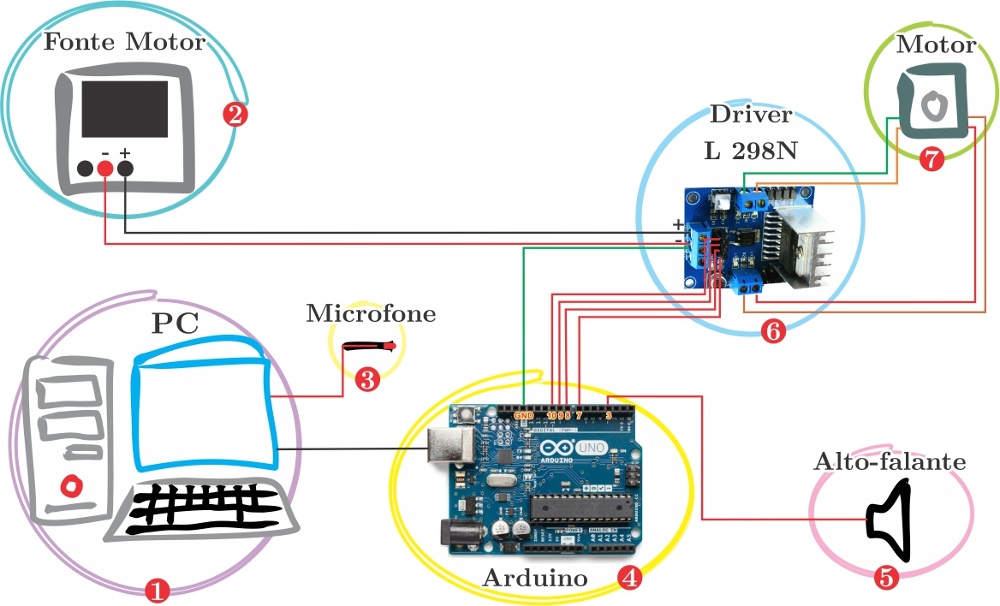

# Standing sound waves

This program has two parts, a master and a slave. The master (Python program) controls when the slave (Arduino) will actually run (move) something. The data capture is made in the master by a microphone. If you use this, please cite us, see bellow.

# Hardware setup

  1. PC is connected to Arduino via USB cable;
  2. A power supply is required to power the L298N Module and motor;
  3. Microfone connected to the PC;
  4. Arduino is connected to the L298N Module (pins 7, 8, 9, 10 and GND);
  5. Speaker (or buzzer) - optional;
  6. L298N is connected to stepper motor.

Remarks: remember to connect the arduino GND to L298N negative, otherwise you may have communication problems.

# Program setup

There are two parameters that are related to the stepper motor and one for the mechanical setup. These two values can be found in the datasheet or using the experimental approach testing the velocity and counting steps using the examples provides by the Arduino IDE in the stepper library. The last value may depends on you mechanical setup so you must measure it. 

`STEPS_PER_REVOLUTION = 100`
`SPEED = 20                  # rpm`
`MM_PER_STEP =               # mm per step`

Those previous values must be correct for the calculus of distance be right. The tip here is, choose a step (STEP) that gives you a integer division for your previous setup, so you do not propagates error during the operations.

`INITIAL_LENGHT = 0.0        # mm`
`FINAL_LENGHT = 300.0        # mm`
`STEP = 1.4                  # mm`

Then you will set how many time you will record for each measure step and a file name for the measure.

`MEASURE_TIME = 0.5        # Measuring time per step`
`FILENAME = 'measure_name' # File name without extension`

# Further information and reference

Further information about the concepts and problems in the standing sound waves in pipes can be found in our work bellow.

If you are using this program, please cite our work:

**Title:** An experimental evaluation of standing sound waves in pipes

**Authors:** Daniel Cosmo Pizetta, Adilson Barros Wanderley, Valmor Roberto Mastelaro, Fernando Fernandes Paiva

**DOI:** 10.1590/1806-9126-RBEF-2016-0264

Some pre formated styles:

Vancouver:

ABNT:

